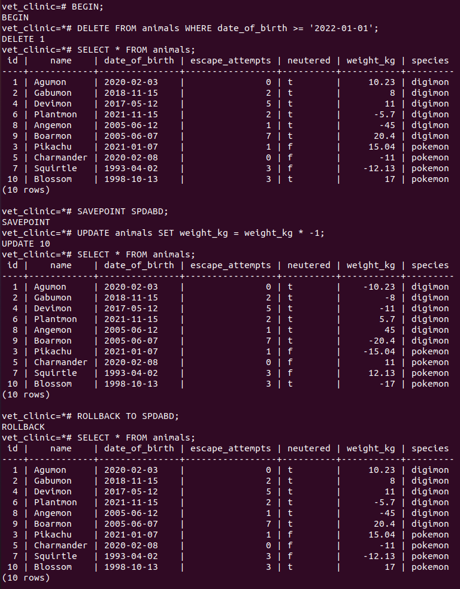

# Vet clinic database: query and update animals table

> In this part of the project, we inserted some more data to the "animals" table that is inside the vet_clinic database. We also used transactions to update and delete records from the table. Finally, we applied some aggregate functions and the GROUP BY statement to answer analytical questions (queries).

## Getting Started

This repository includes files with plain SQL that can be used to recreate a database:

- Use [schema.sql](./schema.sql) to create all tables.
- Use [data.sql](./data.sql) to populate tables with sample data.
- Check [queries.sql](./queries.sql) for examples of queries that can be run on a newly created database. **Important note: this file might include queries that make changes in the database (e.g., remove records). Use them responsibly!**

## Results

- Inside a transaction update the animals table by setting the species column to unspecified. Verify that change was made. Then roll back the change and verify that the species columns went back to the state before the transaction.

- Inside a transaction:
  - Update the animals table by setting the species column to digimon for all animals that have a name ending in mon.
  - Update the animals table by setting the species column to pokemon for all animals that don't have species already set.
  - Commit the transaction.
  - Verify that change was made and persists after commit.
  

  - *New session (changes persist after commit)*:
  

- Inside a transaction delete all records in the animals' table, then roll back the transaction. After the rollback verify if all records in the animals' table still exist.

- Inside a transaction:
  - Delete all animals born after Jan 1st, 2022.
  - Create a savepoint for the transaction.
  - Update all animals' weight to be their weight multiplied by -1.
  - Rollback to the savepoint.
  - Update all animals' weights that are negative to be their weight multiplied by -1.
  - Commit transaction.
  
  

  - *New session (changes persist after commit)*:
  

- Write queries to answer the following questions:
  - How many animals are there?
  - How many animals have never tried to escape?
  - What is the average weight of animals?
  - Who escapes the most, neutered or not neutered animals?
  - What is the minimum and maximum weight of each type of animal?
  - What is the average number of escape attempts per animal type of those born between 1990 and 2000?
  

## Authors

👤 **Jesús Vázquez**

- GitHub: [@jevazquezb](https://github.com/jevazquezb)
- Twitter: [@javb_1187](https://twitter.com/javb_1187)
- LinkedIn: [@jevazquezb](https://www.linkedin.com/in/jevazquezb)

## 🤝 Contributing

Contributions, issues, and feature requests are welcome!

Feel free to check the [issues page](https://github.com/jevazquezb/Vet_clinic_database/issues).

## Show your support

Give a ⭐️ if you like this project!

## Acknowledgments

- My fellow Micronauts.
- Google and Stack Overflow.
- Inspiration.
- etc.

## 📝 License

This project is [MIT](./MIT.md) licensed.
