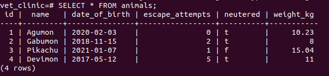
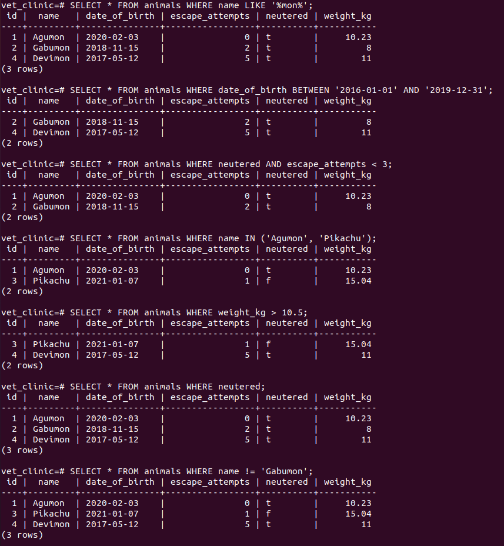

# Vet clinic database: create animals table

> In this part of the project, we used a relational database to create the initial data structure for the vet clinic. We created a table to store animals' information, inserted some data into it, and queried it.

 

## Getting Started

This repository includes files with plain SQL that can be used to recreate a database:

- Use [schema.sql](./schema.sql) to create all tables.
- Use [data.sql](./data.sql) to populate tables with sample data.
- Check [queries.sql](./queries.sql) for examples of queries that can be run on a newly created database. **Important note: this file might include queries that make changes in the database (e.g., remove records). Use them responsibly!**

## Authors

👤 **Jesús Vázquez**

- GitHub: [@jevazquezb](https://github.com/jevazquezb)
- Twitter: [@javb_1187](https://twitter.com/javb_1187)
- LinkedIn: [@jevazquezb](https://www.linkedin.com/in/jevazquezb)

## 🤝 Contributing

Contributions, issues, and feature requests are welcome!

Feel free to check the [issues page](https://github.com/jevazquezb/Vet_clinic_database/issues).

## Show your support

Give a ⭐️ if you like this project!

## Acknowledgments

- My fellow Micronauts.
- Google and Stack Overflow.
- Inspiration.
- etc.

## 📝 License

This project is [MIT](./MIT.md) licensed.
