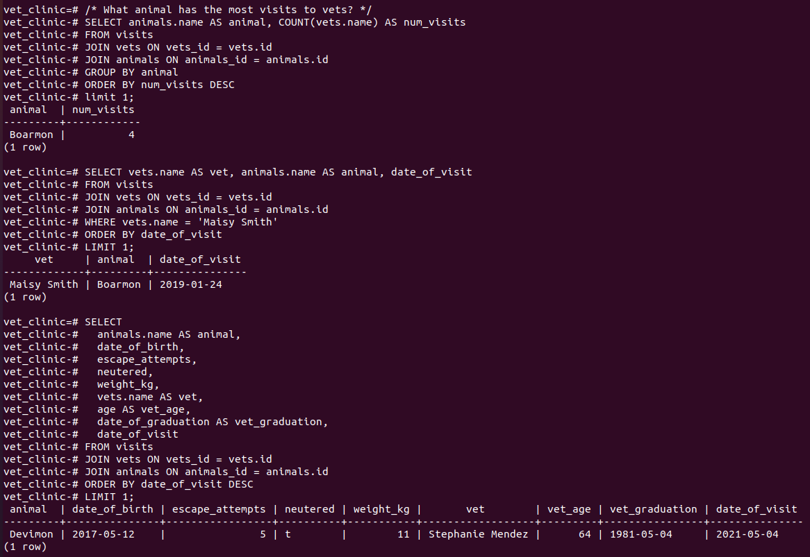

# Vet clinic database: query multiple tables

> In this part of the project, we added some **many-to-many** relationships and wrote more complex queries to answer questions.

## Getting Started

This repository includes files with plain SQL that can be used to recreate a database:

- Use [schema.sql](./schema.sql) to create all tables.
- Use [data.sql](./data.sql) to populate tables with sample data.
- Check [queries.sql](./queries.sql) for examples of queries that can be run on a newly created database. **Important note: this file might include queries that make changes in the database (e.g., remove records). Use them responsibly!**

## Results

- Write queries to answer the following:
  - Who was the last animal seen by William Tatcher?
  - How many different animals did Stephanie Mendez see?
  - List all vets and their specialties, including vets with no specialties.
  - List all animals that visited Stephanie Mendez between April 1st and August 30th, 2020.
  - What animal has the most visits to vets?
  - Who was Maisy Smith's first visit?
  - Details for most recent visit: animal information, vet information, and date of visit.
  - How many visits were with a vet that did not specialize in that animal's species?
  - What specialty should Maisy Smith consider getting? Look for the species she gets the most.
  
  
  

## Authors

👤 **Jesús Vázquez**

- GitHub: [@jevazquezb](https://github.com/jevazquezb)
- Twitter: [@javb_1187](https://twitter.com/javb_1187)
- LinkedIn: [@jevazquezb](https://www.linkedin.com/in/jevazquezb)

## 🤝 Contributing

Contributions, issues, and feature requests are welcome!

Feel free to check the [issues page](https://github.com/jevazquezb/Vet_clinic_database/issues).

## Show your support

Give a ⭐️ if you like this project!

## Acknowledgments

- My fellow Micronauts.
- Google and Stack Overflow.
- Inspiration.
- etc.

## 📝 License

This project is [MIT](./MIT.md) licensed.
